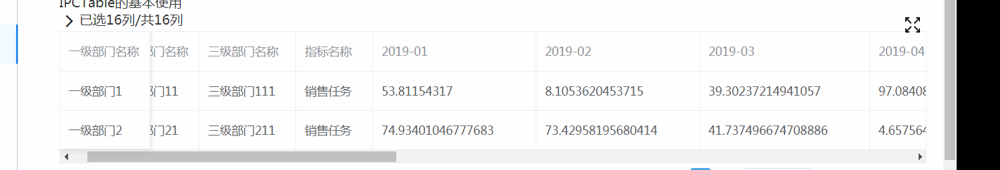

# ipc-table

====

在 element-ui table 的基础上，进行二次封装，以得到功能更强大的表格组件。

功能包括：

- 显示/隐藏列，列排序
- 多级表头
- 自适应列宽
- 合并单元格
- 导出 excel
- 导入 excel
- 固定表头
- 分页
- 编辑单元格

## 下载源代码

在这里
http://source.jd.com/app/ipc-table.git

下载之后，安装依赖包，通过过 `npm run dev` 启动项目。

## demo



## 安装

http://npm.m.jd.com/package/@ipc/table

```
jnpm install @ipc/table
```

## 引入

main.js

```
import IPCTable from "@ipc/table"
Vue.use(IPCTable);
```

## 基本用法

### 模板

```
<IPCTable
    :pColsData="colsData"
    :pRowsData="rowsData">
</IPCTable>
```

### 数据

```
data(){
return {
    colsData: [
    {
        prop: "userName",
        label: "用户名",
    },
    {
        prop: "age",
        label: "年龄",
        classNameFuc: (val,row,column,rowIndex,columnIndex) => {
            return val > 20 ? "classRed" : "classBlue";
        }
    },
    {
        prop: "address",
        label: "地址"
    },
    ],
    rowsData: [
    {
        rowId:1 ,
        userName: "John Brown",
        age:18,
        address:"中华人民共和国北京市大兴区科创十一街京东集团总部C座一层."
    },
    {
        rowId:  2 ,
        userName: "Jim Green" ,
        age: 19,
        address:"中华人民共和国北京市大兴区科创十一街京东集团总部C座一层."
        }
    ]
}
}
```

### 属性

| 参数                           | 说明                                                                                                                                                                                                                                 | 类型    | 可选值 | 默认值        |
| ------------------------------ | ------------------------------------------------------------------------------------------------------------------------------------------------------------------------------------------------------------------------------------ | ------- | ------ | ------------- |
| pColsData                      | 表格的列                                                                                                                                                                                                                             | Array   | 必填   |               |
| pRowsData                      | 表格的行                                                                                                                                                                                                                             | Array   | 必填   |               |
| pIsShowExport                  | 是否提供导出为 excel 功能。一旦设为了 true，会显示一个导出按钮，它能把当前表格中的数据导出成 excel。                                                                                                                                 | Boolean | 可选。 | false         |
| pIsShowImport                  | 是否提供从 excel 中导入功。一旦设为了 true，会显示一个导入按钮，它能从 excel 文件中读出数据并显示在表格中                                                                                                                            | Boolean | 可选。 | false         |
| pFixedHeight                   | 表格整体的高度。如果不设置这个属性，表格的高度是自适应的；如果设置了这个值，则表格被限制在这个高度之内，多余的高度会在垂直方向上显示出滚动条。 例如：pFixedHeight="200"。 它的单位是 px。                                            | Number  | 可选   | 无            |
| pUpdateTableFromExcelEventName | 从 excel 中导入数据时的事件名。它与@importEvent 事件一起使用。如果不设置它的话，导入数据成功后会直接更新数据；如果设置这个值，并监听 importEvent 就会得到从 excel 中导入的 json 格式的数据，用户可根据实际业务对数据进行进一步的操作 | String  | 可选   | 无            |
| pTotalRowNumber                | 一共有多少行。如果设置了这个值，并且这个值大于 0，则会在表格下方出现 分页区域                                                                                                                                                        | Number  | 可选   | 无            |
| pPageSizeOpts                  | 每页显示多少行。                                                                                                                                                                                                                     | Array   | 可选   | [10,20,30,50] |
| pIsMulSelect                   | 是否显示多选。默认为 false。如果设置为 true，则在第一列前插入一列用于供用户勾选。并通过监听`mulSelectChange`来获取当前用户选中的 rowID                                                                                               | Boolean | 可选   | false         |

#### 表格列： pColsData

它是一个对象数组。数组中的每一个对象表示一列。每一个对象的具体格式如下：

| 参数             | 说明                                                                                                                                                                                                                                   |     |
| ---------------- | -------------------------------------------------------------------------------------------------------------------------------------------------------------------------------------------------------------------------------------- | --- |
| prop             | 字符串，必须。 表示列的 key。它与 pRowsData 中的 key 对应。它必须是唯一的                                                                                                                                                              |
| label            | 字符串，必须。 表示列的标题。                                                                                                                                                                                                          |
| classNameFuc     | 可选。用来设置某个单元设置特殊的 css 类。({val,row,column,rowIndex,columnIndex})=>{retur yourClassNameStr} 。 返回值是表示具体 css 类的字符串。                                                                                        |
| children         | 可选。表示多级表头。它的值同样是 pColsData 格式。                                                                                                                                                                                      |
| isMerge          | 可选。是否需要合并这一列的数据。默认是 false。如果设置为 true,就会开启自动合并功能。                                                                                                                                                   |
| isHidden         | 可选。 是否初始隐藏这一列，默认是 false。如果设置为 true,表格初始化时，不会显示这一列,但你还是可以通过“显示，隐藏列”的功能把它再显示出来。                                                                                             |
| canHide          | 可选。这一列是否`可以被隐藏`,默认是 true,表示它会出现的“显示，隐藏列”中，用户可以手动确定它是否显示。如果是 false 则会一直出现在表格中，用户无法隐藏。                                                                                 |
| align            | 可选。String 类型。设置单元格内容在水平方向的对齐方式。可取值为："right"or "left"or"center" 。默认是"center" 表示水平居中。                                                                                                            |
| sortable         | 可选。当前列是否可以排序。默认为 false。                                                                                                                                                                                               |
| renderHeaderFunc | 可选。列标题 Label 区域渲染使用的。 renderHeaderFunc:(h, { column, \$index })=>{return h("h1",column.label + "h1")}                                                                                                                    |
| render           | 可选。单元格渲染使用的。 render:(h, { row, column })=>{return h("div",[h(span,row[column.prop]),h(span,"ok")])}                                                                                                                        |
| formater         | 单元格内容的格式化函数。入参是当前单元格的内容,返回值是将会显示在单元格中的内容。例如你可以让`10000`在表格中显示成`10K`。入参有三个。第一个是单元格的值；第二个是当前列的 prop；第三个是 rowId。eg:(val, prop, rowId)=>{return newVal} |
| width            | 列的宽度,类型是数值（省略了 px）。如果不设置，则通过每行的内容来自适应。                                                                                                                                                               |
| fixed            | 可选。当表格中的列比较多时，我们需要把一部分列固定起来:不随水平方向上的滚动条而移动。fixed 的取值 必须是： "left" or "right"                                                                                                           |

下面是一个 demo:

```
[
    {
        prop: "userName",
        label: "用户名",
        renderHeaderFunc:(h, { column, $index })=>{
            console.info(column)
            return h("h1",column.label + "h1")
          }
    },
    {
        prop: "age",
        label: "年龄",
        classNameFuc: (val,row,column,rowIndex,columnIndex) => {
            return val > 20 ? "classRed" : "classBlue";
        },
        formater: val => {
            return val * 100;
        }
    },
    {
        label: "地址",
        prop: "info",
        children: [{ label: "省", prop: "province" },{ label: "市", prop: "city" }]
    }
]
```

#### 表格数据行： pRowsData

它是一个对象数组。数组中的每一个对象表示数组中的一行。具体格式如下：

- rowId ：必填。 表示行的主键。列的 key。它与 pRowsData 中的 key 对应。它必须是唯一的。
- pColsData 中的某个 prop: 对应单元格的值。 值是基本数据类型。
- pColsData 中的某个 prop: 对应单元格的值。 值是对象(1)。

当它的值是一个对象时，必须遵守如下规则：

```
propName:{
    val:19, // 显示在表格单元格中的值
    editable:true, // 这个单元格是否可以编辑
    validator:(newVal,oldVal)=>{ // 编辑单元格的值时，要用到的检验函数。如果通过检验，返回true；否则返回字符串来具体说明失败的原因。
        if(isNaN(value)){
            return "不是数值"
        }
        return true
    }
}
```

- val: 单元格的值；
- editable: 是否可以编辑
- validator(newVal,oldVal){

}

下面是一个例子：

```
[
    {
        rowId:1 ,
        userName: "John Brown",
        age:{
            val:19,
            editable:true,
            validator:(value)=>{
                if(isNaN(value)){
                    return "不是数值"
                }
            return true
            }
        }
    }
]
```

### 事件

| 事件名                 | 说明                                                                                             | 回调参数                                                                             |
| ---------------------- | ------------------------------------------------------------------------------------------------ | ------------------------------------------------------------------------------------ |
| modifyCellValueSuccess | 修改单元格成功。表示通过这个单元格的校验函数（默认不会有任何检验，除非你提供了自定义的检验函数） | 对象： {oldVal,newVal,editRowId,editColKey,rowIndex,colIndex}                        |
| modifyCellValueFailure | 修改单元格失败。同上。                                                                           | 对象： {msg,oldVal,newVal,editRowId,editColKey,rowIndex,colIndex} msg 表示失败的原因 |
| importEvent            | 从 excel 中导入数据。与 pUpdateTableFromExcelEventName 配合使用                                  | JSON 格式的数据                                                                      |
| pageIndexChange        | 翻页                                                                                             | 当前页的索引                                                                         |
| pageSizeChange         | 每页显示几条发生了变化                                                                           | 当前 pagesize 的值                                                                   |
| mulSelectChange        | 如果 pIsMulSelect 设置为 true，当用户进行选择时会抛出此事件                                      | Array，保存当前选中行的 rowId 的值                                                   |
| checkListChange        | 隐藏，显示列时，会抛出此事件                                                                     | 负荷： {curProp:当前变化的 prop,allStatus:当前所有列的显示隐藏状态)}                 |
| header-dragend         | 通过鼠标调整列宽时会抛出事件                                                                     | 负荷： { newWidth, oldWidth, column, event }                                         |

#### 使用 pUpdateTableFromExcelEventName 和 importEvent 的 demo

```
<IPCTable
    :pIsShowImport="true"
    pUpdateTableFromExcelEventName="importEvent"
    @importEvent="hImportEvent"
    :pIsShowExport="true"
    :pColsData="colsData"
    :pRowsData="rowsData">
</IPCTable>
```

### 方法

#### \_selectAll

功能：全选表格中的行

示例：

```
this.$refs.XXXXtable._selectAll()
```

#### \_disableSelect

功能：清除表格的选中项，并让表格处于不可选中的状态

示例：

```
this.$refs.XXXXtable._disableSelect()
```

#### \_enableSelect

功能：让表格处于可选中的状态

示例：

```
this.$refs.XXXXtable._enableSelect()
```

#### \_getHidenCols

功能： 获取当前表格中被隐藏的列，以数组的格式返回。

示例：

```
this.$refs.XXXXtable._getHidenCols()
```
